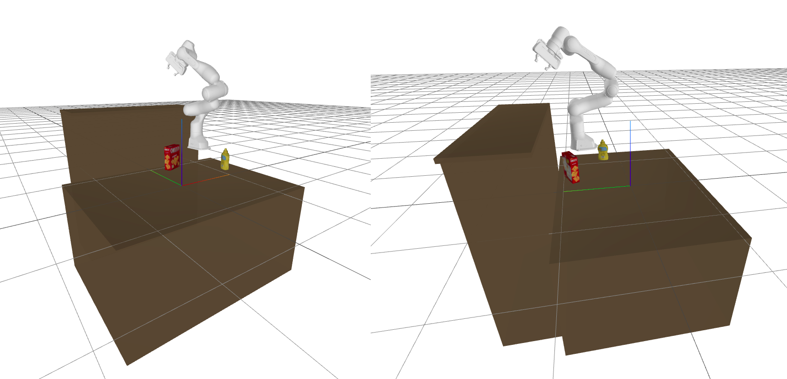
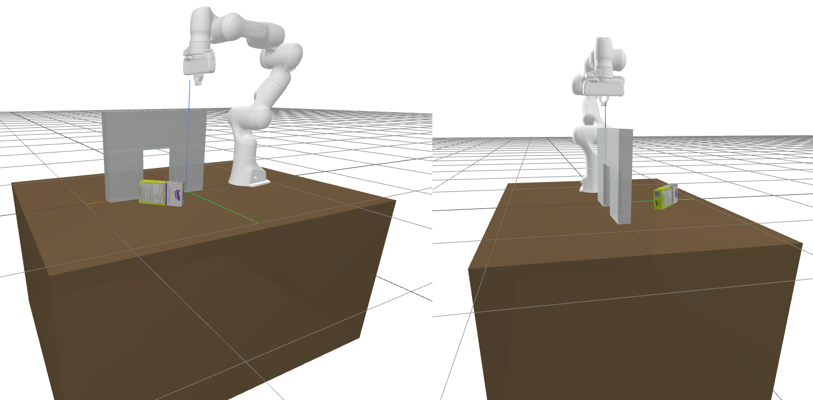
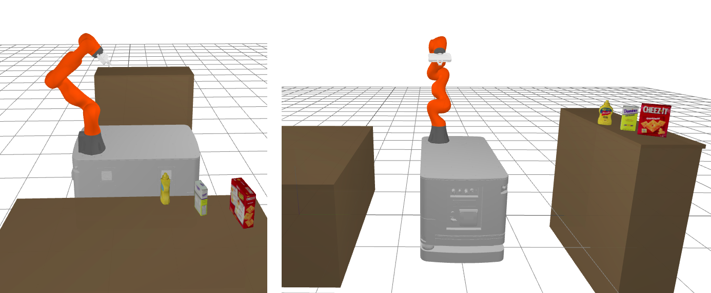

# GuidedTAMPBenchmark

This repository contains code for benchmarking/evaluating task-and-motion-planners guided by video demonstration. 
The code was used in ICRA 2023 submission entitled 
**Multi-Contact Task and Motion Planning Guided by Video Demonstration**:

```bibtex
@inproceeding{2023ICRA_Zorina,
  author = {Zorina, Kateryna and Kovar, David and Lamiraux, Florent and Mansard, Nicolas and Carpentier, Justin and Sivic, Josef and Petrik, Vladimir},
  title = {{Multi-contact task and motion planning guided by video demonstration.}},
  booktitle={ICRA 2023-International Conference on Robotics and Automation},
  year={2023}
}
```

Additional resources:
[ICRA2023 planner source code](https://github.com/agimus-project/tamp_guided_by_video), 
[Project page](https://data.ciirc.cvut.cz/public/projects/2023VideoGuidedTAMP/),
[Video overview](https://youtu.be/P8Nld03eai0)

## Installation
```bash
git clone https://github.com/agimus-project/guided_tamp_benchmark.git
conda create -n gtamp python=3.10 poetry
conda activate gtamp
poetry install
```

## Usage
To evaluate your planner, you need to implement all abstract methods from `core.planner.BasePlanner` class.
Then you can use our benchmarking script to evaluate it, for example:
```python
task = ShelfTask(1, PandaRobot(), 2)
b = Benchmark()
b.do_benchmark(
    task=task,
    planner=YourPlannerCls,
    seeds=[1],
    planner_arg={"verbose": True,},
    max_planning_time=60,
    delta=0.001,
)

```
See our [examples](examples/) directory for more information or our ICRA2023 planner https://github.com/agimus-project/tamp_guided_by_video that utilizes this benchmark for the evaluation.

## Benchmark variability
### Tasks
There are three tasks implemented: Shelf Task, Waiter Task, and Tunnel Task.
Here is an example of task initialization:

```python
from guided_tamp_benchmark.tasks import ShelfTask
from guided_tamp_benchmark.models.robots import *

task = ShelfTask(0, PandaRobot(), 1)
```

In this example, a Shelf Task with the first demonstration (i.e., number 0) is created with Panda Robot which base is placed at the reference pose number 1.

### Shelf Task
The shelf task is composed of a table, a shelf and a varying
set of objects that the robotic manipulator is supposed to
arrange, i.e. to move the objects to the predefined poses
on the table or on the shelf. The complexity of the task
is controlled by the number of objects that the robot should
arrange. This task is challenging for state-of-the-art planners
because it requires moving multiple objects in a single
planning task.

### Tunnel Task
The tunnel task consists of a tunnel and a single object that
should be transferred through the tunnel. The tunnel is thin
enough so that the robot can place an object inside the tunnel
on one side and pick it up from the other side. The challenge
lies in the narrow passage in the admissible configuration
space that needs to be discovered by the planner.

### Waiter Task
The waiter task simulates the job of waiter, in which a set of
objects needs to be transferred from one location to another
distant location. Waiters use a tray to minimize the walked
distance. In our simulation, a mobile robot is equipped with
a tray-like space that it can use for transferring objects.
Discovering the tray in the planning state-space is non-trivial,
which makes this task challenging for the planners that do
not utilize demonstrations


### Robots
We implemented following robots for benchmarking:
- Panda robot (fixed base, 7DoF),
- UR5 robot (fixed base, 6DoF),
- KUKA IIWA robot (fixed base, 7DoF),
- KUKA KMR IIWA robot (mobile base, 7+3DoF).


## Code structure
### Core
In `guided_tamp_benchmark.core` is description of base planner function that is compatible with benchmarking script and is to be used as template.
Description of configuration class, used for storing scene configuration, and path class, which is a template class for storing path planned by planner is also there.
### Models
In `guided_tamp_benchmark.models` is description of robots, furniture and objects used in different tasks of benchmark.
### Scripts
In `guided_tamp_benchmark.scripts` is class benchmark that can be used for running benchmark on planner.
### Tasks
In `guided_tamp_benchmark.tasks` are classes with descriptions of benchmarking tasks, renderer, demonstration class used for storing and loading demonstration files saved as .pkl files and collision class used for collision checking for path evaluation.

## Acknowledgment
This work is part of the [AGIMUS](https://www.agimus-project.eu/) project, funded by the European Union under GA no.101070165. Views and opinions expressed are however those of the author(s) only and do not necessarily reflect those of the European Union or the European Commission. Neither the European Union nor the European Commission can be held responsible for them. This work was funded by the European Regional Development Fund under the project [IMPACT](http://impact.ciirc.cvut.cz/) (reg. No. CZ.02.1.01/0.0/0.0/15\_003/0000468), the Grant Agency of the Czech Technical University in Prague, grant No. SGS21/178/OHK3/3T/17.
